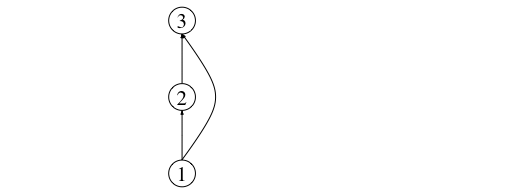
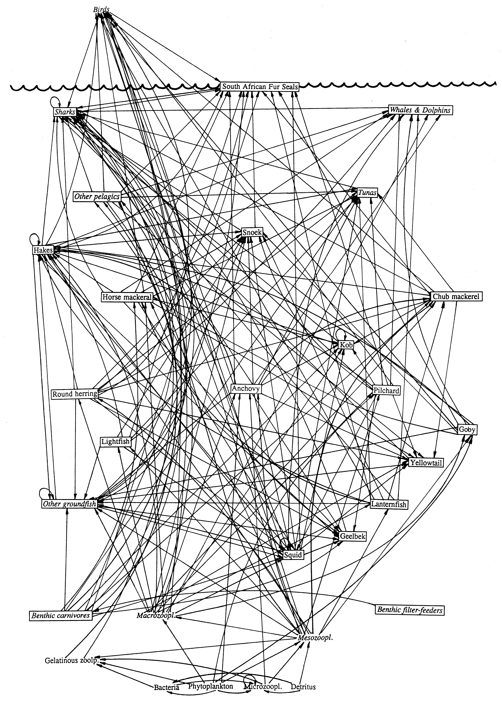

## Network formats: edgelists and adjacency matrices

To be able to manipulate and analyse networks in an automated way, we need to represent them in a way that is understandable by a computer.

Several computer readable formats exist to store the description and information contained in a network. The most commonly used in ecology (and other disciplines) are: (i) adjacency matrices, and (ii) edgelists.

Adjancecy matrices are matrices in which columns and rows represent the nodes (species) in the network, and a link (interaction) between them is repsented as a 1, while the absence of a link is represented as a 0.

In a foodweb, for example, as we saw previously, links are directed from prey to predator. In the adjacency matrix, the rows represent prey species and the columns represent predators. Thus, an interaction a<sub>ij</sub> runs from prey i to predator j.

In the case of a mutualistic (i.e. bipartite) network, species are not all represented in each dimension of the matrix (rows and columns). Instead hosts are usually shown in rows and their mutualistic partners are shown in columns. This makes these matrices non-square.

Edge lists, on the other hand, are lists of pairs of identifiers (usually integers) that denote links (or ecological interactions) from the first item in pair to the second. For example, a network specified by the following edgelist: 

1 2 <br>
2 3 <br>
1 3 <br>

is one with three nodes: V = {1,2,3}, and three links: one from basal prey 1 to primary consumer 2, another one from prey (primary consumer) 2 to top predator 3, and finally, an interaction between the basal resource and the top predator (E = {(1,2), (2,3), (1,3)}). This makes the top predator an omnivorous species. A representation of this network is shown below:



This network can be represented as an adjacency matrix thus:


More sophisticated ways of representing and storing networks exist, such as for example the [GraphML](http://graphml.graphdrawing.org) format, in which additional information about the network, the nodes, and the links can be included in the description.

In this course, we will use edge lists as a starting format and then convert that representation into an adjacency matrix.

Throughout the course we will use a few examples of real ecological networks taken publicly available databases such as the well-known food web from the Benguela upwelling marine system off the Western coast of Africa:


{height=500px}

Image taken from Yodzis, P (1998) *Local trophodynamics and the interaction of marine mammals and fisheries in the Benguela ecosystem*. **Journal of Animal Ecology**. 67, 635-658.

This, and other ecological networks datasets are available from the [Global Food Web Database](https://www.globalwebdb.com/).

The code below will enable you to download the edgelist file and use it to create an adjacency matrix representation of the network. Two representations of the network then remain available: the Edgelist representation (`benguela.EL`) and the Adjacency Matrix representation (`benguela.AM`).

```{r}
library(RCurl)
x <- getURL("https://raw.githubusercontent.com/seblun/networks_datacamp/master/datasets/benguela.tro")
benguela.EL <- read.table(text = x) 
benguela.EL <- as.matrix(benguela.EL)
```


```{r}
# Create an adjacency matrix called benguela.AM, containing only zeros
benguela.AM <- matrix(0, max(benguela.EL), max(benguela.EL))

# Introduce ones to the matrix to represent interactions between species
benguela.AM[benguela.EL] <- 1
```


***
## [Continue to Ecological networks: Species and interactions](lesson-3.html){.continue-link}
