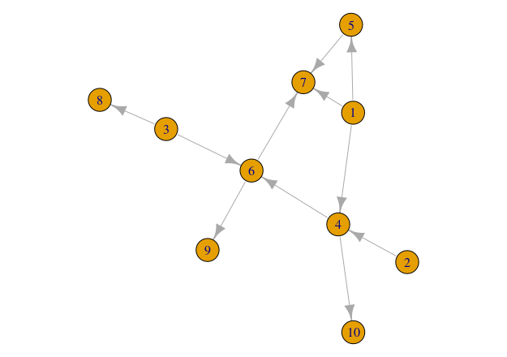

As we have seen, edge lists and adjacency matrices are convenient ways in which interaction networks can be represented. However, more flexible formats for representing networks are needed when we want to perform more complex actions on networks, or even just for visualisation purposes.

The field of mathematics has been studying networks for decades. The mathematics subfield of [Graph Theory](https://en.wikipedia.org/wiki/Graph_theory) has developed extensive frameworks to analyse and manipulate mathematical objects known as `graphs`. Graphs, as networks, are simply collections of nodes and links between them. So, we can represent networks as graphs and take advantage of the mathematical framework of Graph Theory to study them.

Several computer programming libraries have been especially developed to construct and manipulate graphs. These libraries make it easy and widely accessible to work with and study networks. Amongst the most popular the [NetworkX](https://networkx.github.io/) complex networks library for [Python](https://www.python.org/) and the [igraph](https://igraph.org/) package for network analysis, which can be used on several platforms, including [R](https://www.r-project.org/). For the rest of this course we will be using `igraph` to create and manipulate ecological networks.

To install and load igraph on your R workspace runt the following code:

```{r, eval=FALSE}
## Install igraph
install.packages("igraph")

## Load igraph into workspace
library(igraph)
```

To start getting familiar with igraph we will start by creating some simple networks.

## Weaving networks from scratch

The following instructions will walk you through a simple example in which you will create a small network:

1 First create a vector called `species` with the numbers from 1 to 10
2 Then create a network by adding the `species` as `vertices` to an empty graph.
3 Create an interaction between species 5 and 7
4 Create 10 other interactions between any species you want

```{r}
library(igraph)
# Ten species
species <- 1:10
network <- graph.empty() + vertices(species)

# Link between species 5 and 7
network[5,7] <- 1

```

The igraph library also lets you draw your networks in a very straigthforward way, simply using the plot function.

```{r, eval=FALSE}
# Plotting your network
plot(network)
```

If the instructions above worked well you will be able to see something like this:



## Graph connectivity / Food web connectance

Now that we have an igraph representation of our network, we can calculate several of its properties. If we think of the network we just constructed as a food web, we can calculate the number of species and links (what we did previously on adjacency matrices) thus:

```{r}
# number of species
S <- vcount(network)

# number of interactions
L <- ecount(network)

```

The functions `vcount` and `ecount` from the igraph library let you count the number of nodes and links on a graph, respectively.

Having counted the number of species and links in our newly built food web, we can start calculating more interesting prorperties such as connectivity. In food webs connectivity can be quantified as the average number of interactions per species (L/S, i.e. the mean number of interactions species in the network have), and `Connectance` (L/S^2^, i.e. the fraction of links present in the network out of all possible links).

```{r}
# average number of interactions species
L.S <- L/S

# food web connectance
C <- L/S^2

```

Now that we are familiar with the basics of ecological networks and how to create them and manipulate them in R, let's do some ecological networks analysis!

***
## [Continue to Food Web Properties](lesson-5.html){.continue-link}
